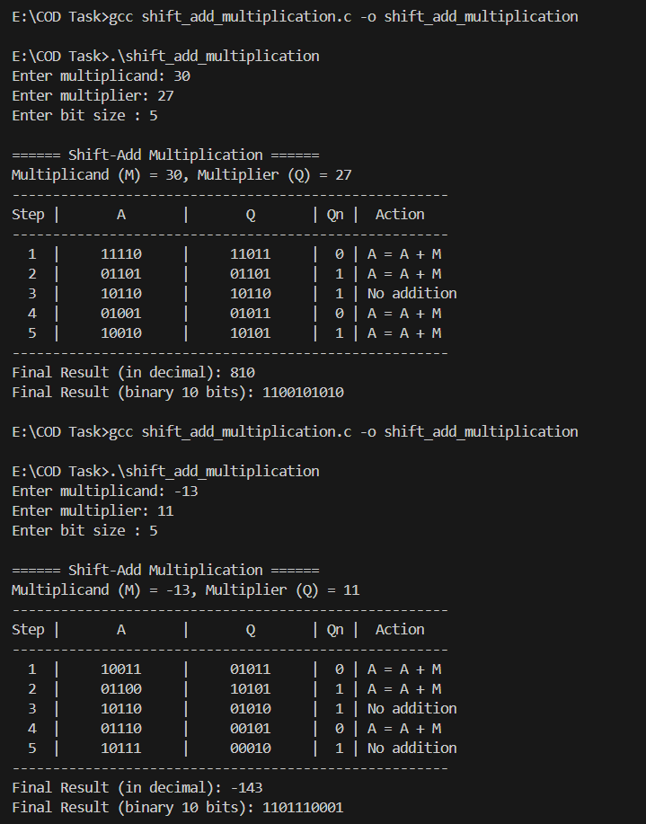
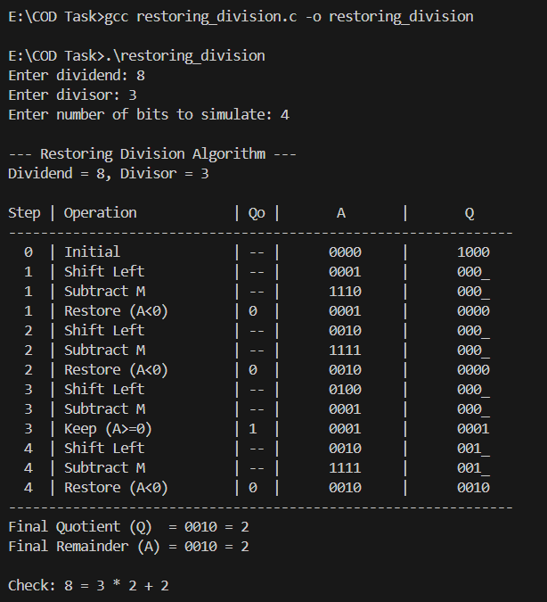
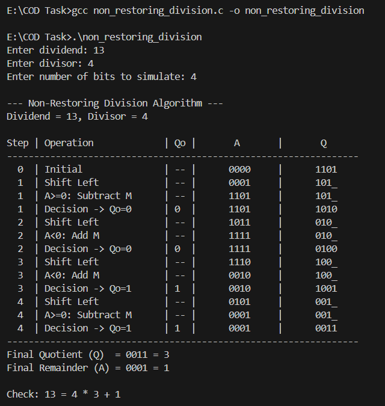

# IS2101: Implementing Integer Multiplication and Division Algorithms in C

This repository contains C programs that simulate hardware-level arithmetic algorithms for: **Sequential Multiplication, Restoring Division, and Non-Restoring Division**. The objective is to provide a clear, step-by-step visualization of how processors perform multiplication and division on binary numbers.
***

## 📂 Repository Structure

This project contains source code files in the root directory and corresponding output screenshots in the `Outputs` directory.

```
IS2101-ArithmeticOps-NNM24IS205/
│
├── shift_add_multiplication.c
├── restoring_division.c
├── non_restoring_division.c
│
├──Outputs/
│   ├── shift_add_multiplication_output.png
│   ├── restoring_division_output.png
│   └── non_restoring_division_output.png
│
└── README.md
```
***

## ⚙️ Compilation & Execution

A C compiler like `gcc` is required and the following commands can be used in a terminal to compile and run each program.

### 1\. Sequential (Shift-Add) Multiplication

  * **Description:** Implements signed integer multiplication using shift-add algorithm.
  * **Compile:**
    ```bash
    gcc shift_add_multiplication.c -o shift_add_multiplication.exe
    ```
  * **Execute:**
    ```bash
    .\shift_add_multiplication.exe
    ```

### 2\. Restoring Division

  * **Description:** Implements unsigned integer division using the restoring method.
  * **Compile:**
    ```bash
    gcc restoring_division.c -o restoring_division.exe
    ```
  * **Execute:**
    ```bash
    .\restoring_division.exe
    ```

### 3\. Non-Restoring Division

  * **Description:** Implements unsigned integer division using the non-restoring method.
  * **Compile:**
    ```bash
    gcc non_restoring_division.c -o non_restoring_division.exe
    ```
  * **Execute:**
    ```bash
    .\non_restoring_division.exe
    ```
***

## 📥 Inputs & 📤 Outputs

Each program interactively prompts the user for input and produces a detailed output that illustrates the step by step execution of the algorithm along with the state of the hardware registers at each cycle.

  * **Sequential Multiplication:**

      * **Inputs:** `Multiplicand`, `Multiplier`, `Bit Size`.
      * **Output:** The program shows how the values in the Accumulator (A) and Multiplier (Q) registers change at each step of the multiplication. In the end, it displays the final result in both binary and decimal form.

  * **Restoring & Non-Restoring Divisions:**

      * **Inputs:** `Dividend`, `Divisor`, `Number of bits to simulate`.
      * **Output:** These programs show how the values in the Accumulator (A) and Quotient (Q) registers change at each step of the division. Finally, it displays the Quotient and Remainder in both binary and decimal form.
***

## ✅ Sample Outputs

Here are the output screenshots from running the programs with the specified inputs.

### Sequential Multiplication Output (`30 * 27` and `-13 * 11`)



### Restoring Division Output (`8 / 3`)



### Non-Restoring Division Output (`13 / 4`)


